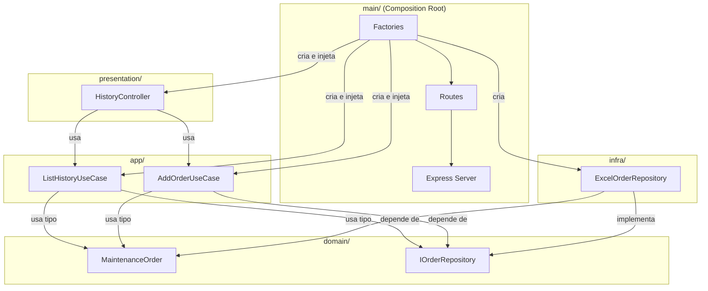

# 🎓 Guia: Construindo a App de Histórico de OMs com Clean Architecture

## Visão Geral do Projeto

**O que vamos construir:** Uma aplicação onde o usuário escaneia um QR Code colado em um equipamento e vê o histórico de Ordens de Manutenção (OMs) daquele equipamento, podendo também inserir novas OMs.

**Stack:** Node.js + Express + TypeScript (backend) | React + Vite + TypeScript (frontend)

---

## 🧠 Conceitos Fundamentais (Entenda ANTES de Codar)

### 1. Clean Architecture — As 4 Camadas

Pense na sua aplicação como uma **cebola com camadas**. A regra de ouro é:

> **Camadas internas NÃO conhecem camadas externas.**

```
┌─────────────────────────────────────────────┐
│  main/         → Composition Root           │  ← Camada MAIS EXTERNA
│  presentation/ → Controllers + Rotas        │
│  infra/        → Implementações concretas   │
│  app/          → Casos de Uso               │
│  domain/       → Entidades + Interfaces     │  ← Camada MAIS INTERNA (coração)
└─────────────────────────────────────────────┘
```

| Camada | Responsabilidade | Exemplo no seu projeto |
|---|---|---|
| `domain/` | Entidades puras e **contratos** (interfaces). Zero dependência externa. | `MaintenanceOrder` (entidade), `IOrderRepository` (interface) |
| `app/` | Casos de uso. Orquestram o fluxo usando as interfaces do domain. | `ListHistoryUseCase`, `AddOrderUseCase` |
| `infra/` | Implementações concretas das interfaces do domain. | `ExcelOrderRepository` (lê o [.xlsx](file:///c:/Users/Ery%C3%A1lef%20Vieira/Work%20Folder/Vale/Projeto_historico_OMs_equipamentos/arquivo_teste.xlsx)) |
| `presentation/` | Controllers que recebem HTTP Request e devolvem Response. | `HistoryController` |
| `main/` | **Composition Root** — onde tudo é "conectado" (injeção de dependência manual). | `server.ts`, `factories/` |

### 2. Dependency Inversion Principle (DIP) — O "D" do SOLID

O princípio diz:

> **Módulos de alto nível NÃO devem depender de módulos de baixo nível. Ambos devem depender de abstrações (interfaces).**

**Na prática no seu projeto:**
- O `ListHistoryUseCase` (alto nível, camada `app/`) **precisa** ler dados de um arquivo Excel.
- Mas ele **NÃO** deve importar diretamente o `ExcelOrderRepository`.
- Ele importa apenas a **interface** `IOrderRepository` (definida no `domain/`).
- Quem "conecta" a implementação concreta à interface é a camada `main/`.

```
❌ ERRADO (acoplamento direto):
  ListHistoryUseCase → importa → ExcelOrderRepository

✅ CORRETO (inversão de dependência):
  ListHistoryUseCase → importa → IOrderRepository (interface do domain)
  ExcelOrderRepository → implementa → IOrderRepository
  main/ → injeta ExcelOrderRepository no ListHistoryUseCase
```

### 3. Dependency Injection (DI) — O Mecanismo

É o **mecanismo** que aplica o DIP. No seu caso faremos **injeção manual via construtor**:

```typescript
// O UseCase recebe a dependência pelo construtor, não cria ela internamente
class ListHistoryUseCase {
  constructor(private readonly repository: IOrderRepository) {} // ← INJEÇÃO
  
  async execute(): Promise<MaintenanceOrder[]> {
    return this.repository.listAll() // usa a interface, não sabe se é Excel, SQL, etc.
  }
}
```

---

## 🗺️ Roadmap — Ordem de Implementação

Siga esta ordem. Cada passo constrói sobre o anterior.

---

### 📌 PASSO 1: Camada `domain/` — Entidades e Contratos

> **Por que começar aqui?** É o coração da aplicação. Não depende de nada. Define O QUE a aplicação faz, sem se preocupar com COMO.

#### Tarefa 1.1: Criar a Entidade `MaintenanceOrder`

Crie `server/src/domain/entities/MaintenanceOrder.ts`

- É um tipo/classe que representa uma Ordem de Manutenção
- Baseie-se nas colunas do seu Excel de teste
- Para a **listagem**, selecione apenas as colunas resumidas (Ordem, Data Início, Data Fim, Tipo, Texto Breve)
- Para a **inserção**, você precisará de todas as colunas relevantes
- **Dica:** Comece simples, com um `type` ou `interface` TypeScript

#### Tarefa 1.2: Criar a Interface do Repositório

Crie `server/src/domain/repositories/IOrderRepository.ts`

- Defina os **contratos** que qualquer repositório deve cumprir
- Métodos sugeridos:
  - `listByEquipment(equipmentId: string): Promise<MaintenanceOrder[]>` — lista OMs por equipamento
  - `addOrder(order: MaintenanceOrder): Promise<void>` — adiciona uma nova OM

> [!IMPORTANT]
> **Sobre o [ListHistory.ts](file:///c:/Users/Ery%C3%A1lef%20Vieira/Work%20Folder/Vale/Projeto_historico_OMs_equipamentos/server/src/domain/use%20cases/ListHistory.ts) que você já tem:** Você já definiu interfaces nele, o que é ótimo! Mas reorganize: separe a **entidade** (`MaintenanceOrder`) das **interfaces de repositório** (`IOrderRepository`). O use case em si (a lógica) vai ficar na camada `app/`, não no `domain/`. No `domain/` ficam apenas os **tipos** e os **contratos**.

#### Estrutura esperada após o Passo 1:
```
server/src/domain/
├── entities/
│   └── MaintenanceOrder.ts    ← tipo/interface da entidade
└── repositories/
    └── IOrderRepository.ts    ← interface do repositório
```

---

### 📌 PASSO 2: Camada `app/` — Casos de Uso

> **Por que segundo?** Os use cases dependem APENAS do `domain/`. Eles orquestram a lógica de negócio.

#### Tarefa 2.1: Criar `ListHistoryUseCase`

Crie `server/src/app/use-cases/ListHistoryUseCase.ts`

- Recebe `IOrderRepository` via construtor (injeção de dependência)
- Tem um método `execute(equipmentId: string)` que chama `repository.listByEquipment(equipmentId)`
- **Padrão:** Cada use case faz UMA coisa. Tem um único método público `execute()`

#### Tarefa 2.2: Criar `AddOrderUseCase`

Crie `server/src/app/use-cases/AddOrderUseCase.ts`

- Mesmo padrão: recebe `IOrderRepository` via construtor
- Método `execute(order: MaintenanceOrder)` que chama `repository.addOrder(order)`
- Aqui podem vir validações de negócio (ex: campos obrigatórios, formato de data)

#### Estrutura esperada após o Passo 2:
```
server/src/app/
└── use-cases/
    ├── ListHistoryUseCase.ts
    └── AddOrderUseCase.ts
```

---

### 📌 PASSO 3: Camada `infra/` — Implementação Concreta

> **Por que terceiro?** Agora que sabemos O QUE o repositório precisa fazer (interface), implementamos COMO ele faz.

#### Tarefa 3.1: Instalar a lib de leitura de Excel

```bash
npm install xlsx
npm install -D @types/xlsx  # se existir
```

A biblioteca [xlsx](file:///c:/Users/Ery%C3%A1lef%20Vieira/Work%20Folder/Vale/Projeto_historico_OMs_equipamentos/arquivo_teste.xlsx) (SheetJS) é a mais popular para ler/escrever arquivos [.xlsx](file:///c:/Users/Ery%C3%A1lef%20Vieira/Work%20Folder/Vale/Projeto_historico_OMs_equipamentos/arquivo_teste.xlsx) no Node.

#### Tarefa 3.2: Criar `ExcelOrderRepository`

Crie `server/src/infra/repositories/ExcelOrderRepository.ts`

- **Implementa** a interface `IOrderRepository`
- Recebe o caminho do arquivo Excel no construtor
- `listByEquipment()` — usa [xlsx](file:///c:/Users/Ery%C3%A1lef%20Vieira/Work%20Folder/Vale/Projeto_historico_OMs_equipamentos/arquivo_teste.xlsx) para ler o arquivo, parsear e retornar as linhas como `MaintenanceOrder[]`
- `addOrder()` — lê o arquivo, adiciona a nova linha ao sheet, salva o arquivo

> [!TIP]
> **Perceba a beleza da inversão de dependência aqui:** Se amanhã você trocar de Excel para um banco de dados PostgreSQL, basta criar `PostgresOrderRepository` implementando a mesma interface. **Nenhum use case precisa mudar.**

#### Estrutura esperada após o Passo 3:
```
server/src/infra/
└── repositories/
    └── ExcelOrderRepository.ts
```

---

### 📌 PASSO 4: Camada `presentation/` — Controllers

> **Por que quarto?** Com a lógica pronta, criamos a interface HTTP.

#### Tarefa 4.1: Criar `HistoryController`

Crie `server/src/presentation/controllers/HistoryController.ts`

- Recebe os use cases via construtor
- Métodos:
  - `list(req, res)` — pega `equipmentId` dos params, chama `ListHistoryUseCase.execute()`, retorna JSON
  - `add(req, res)` — pega dados do body, chama `AddOrderUseCase.execute()`, retorna status
- **Padrão importante:** O controller NÃO contém lógica de negócio. Ele apenas:
  1. Extrai dados do Request
  2. Chama o Use Case
  3. Formata o Response

> [!TIP]
> **Padrão adaptador:** Um bom design é criar uma interface `HttpRequest`/`HttpResponse` genérica na presentation, para não acoplar diretamente ao Express. Mas para simplificar neste projeto, pode usar `req/res` do Express diretamente.

#### Estrutura esperada após o Passo 4:
```
server/src/presentation/
└── controllers/
    └── HistoryController.ts
```

---

### 📌 PASSO 5: Camada `main/` — Composition Root (Amarrar Tudo)

> **Por que por último?** Aqui é onde fazemos a injeção de dependência manual. Precisamos de todas as peças prontas.

#### Tarefa 5.1: Criar as "Factories"

Crie `server/src/main/factories/makeListHistoryController.ts`

```
Pseudocódigo:
1. Instancia o ExcelOrderRepository (passa o path do Excel)
2. Instancia o ListHistoryUseCase (injetando o repository)
3. Instancia o HistoryController (injetando o use case)
4. Retorna o controller pronto
```

#### Tarefa 5.2: Criar as Rotas

Crie `server/src/main/routes/historyRoutes.ts`

- Define `GET /history/:equipmentId` → chama `makeListHistoryController()` e seu método `list`
- Define `POST /history/:equipmentId` → chama `makeAddOrderController()` e seu método `add`

#### Tarefa 5.3: Atualizar o [index.ts](file:///c:/Users/Ery%C3%A1lef%20Vieira/Work%20Folder/Vale/Projeto_historico_OMs_equipamentos/server/src/index.ts)

- Importe e use as rotas criadas no Express

#### Estrutura esperada após o Passo 5:
```
server/src/main/
├── factories/
│   ├── makeListHistoryController.ts
│   └── makeAddOrderController.ts
├── routes/
│   └── historyRoutes.ts
└── server.ts (ou atualizar o index.ts existente)
```

---

### 📌 PASSO 6: Frontend (Após Backend Funcional)

Só comece o frontend quando o backend estiver respondendo corretamente via Postman/Insomnia.

- Use **React + Vite** (como no seu guia)
- Integre um leitor de QR Code (lib sugerida: `react-qr-reader` ou `html5-qrcode`)
- O QR Code conterá o `equipmentId`
- Ao escanear, faça `GET /history/{equipmentId}` e exiba a tabela
- Formulário para inserir nova OM via `POST /history/{equipmentId}`

---

## 🏗️ Diagrama de Dependências Final



> **Note que as setas de dependência nunca vão de dentro pra fora.** Os Use Cases importam do `domain/`, nunca do `infra/`. Quem faz a ponte é o `main/`.

---

## ✅ Checklist de Progresso

- [ ] **Passo 1:** Entidades e Interfaces no `domain/`
- [ ] **Passo 2:** Use Cases no `app/`
- [ ] **Passo 3:** `ExcelOrderRepository` no `infra/`
- [ ] **Passo 4:** Controller no `presentation/`
- [ ] **Passo 5:** Factories, Rotas e Server no `main/`
- [ ] **Passo 6:** Frontend com QR Code Reader

---

## 💡 Dicas Gerais

1. **Teste cada camada isoladamente.** Após o Passo 2, você pode testar o use case com um "repositório falso" (mock) sem precisar do Excel.
2. **Nomeie pastas sem espaços.** Renomeie `use cases` para `use-cases` ou `useCases` — espaços em nomes de pasta causam problemas.
3. **Um arquivo, uma responsabilidade.** Evite colocar entidade + interface + use case no mesmo arquivo.
4. **Commits pequenos e frequentes.** Faça um commit ao final de cada Passo.

---

**Comece pelo Passo 1!** Quando terminar, me mostre o código que você criou e eu farei a revisão. 🚀
